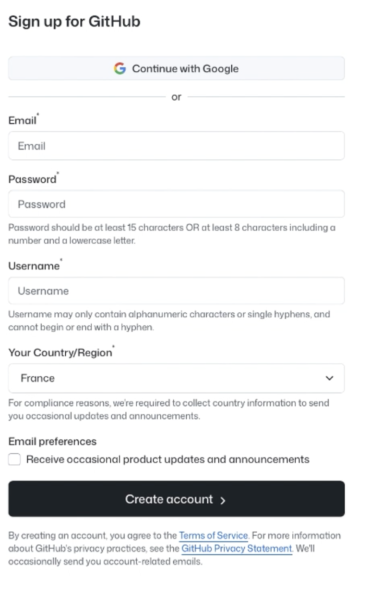
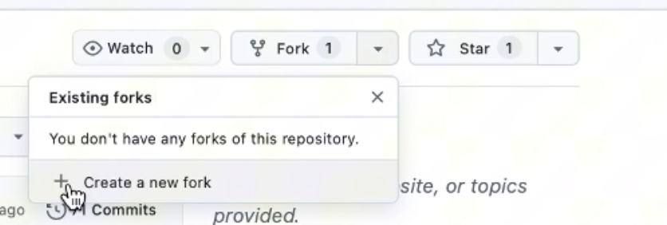
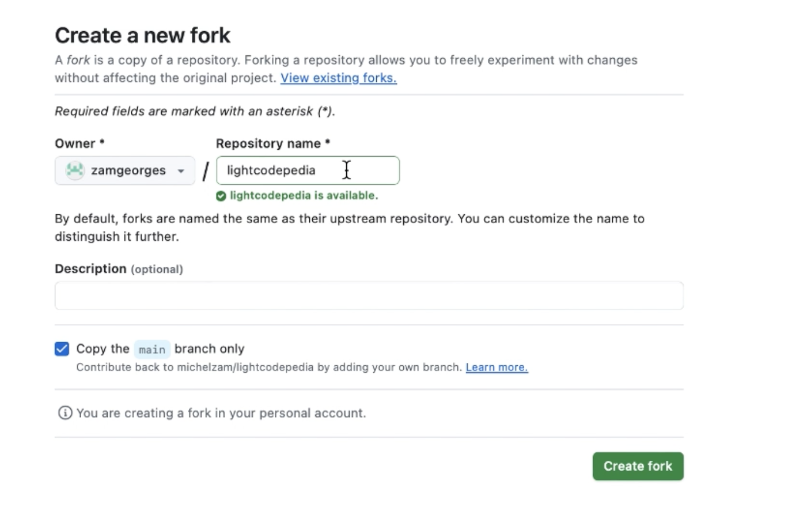
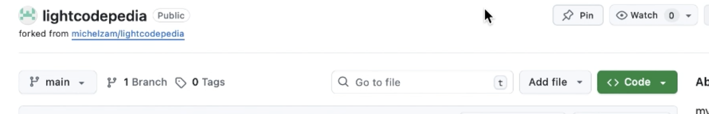
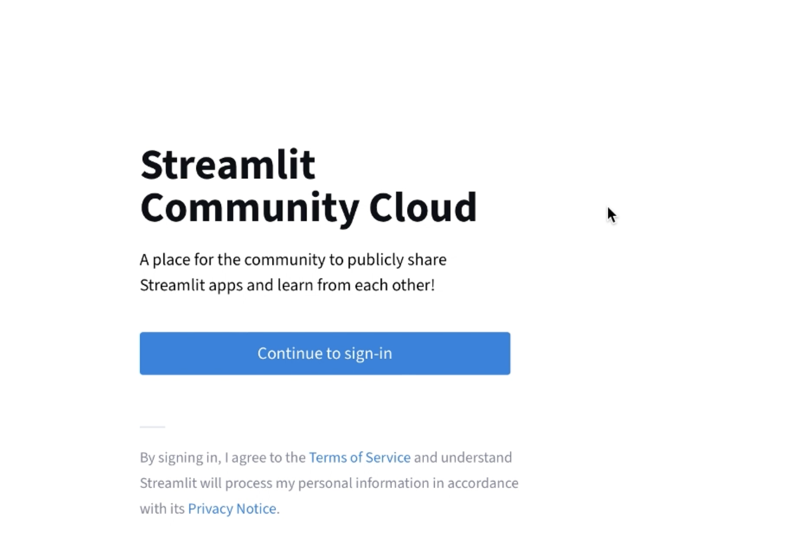
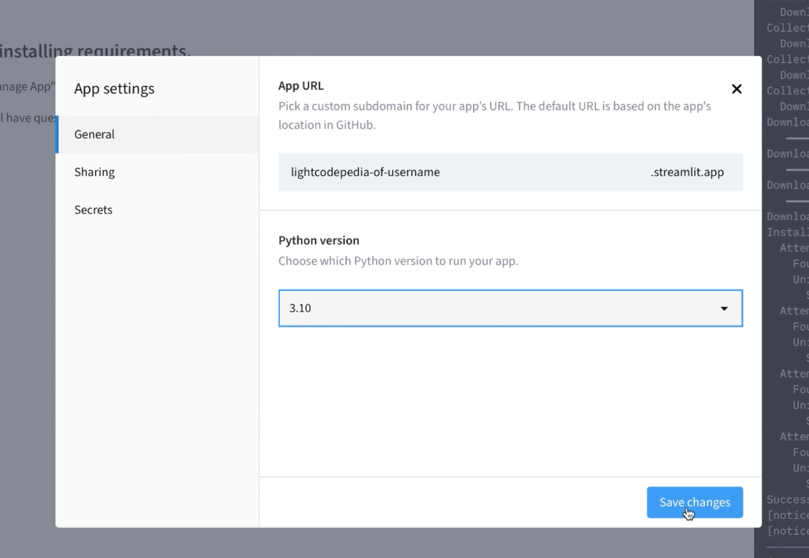

## Welcome ##
Made with Streamlit, Smalljects and 

# Deploy **LightCodePedia** to Streamlit Community Cloud (via GitHub)

> Follow this guide to create a GitHub account, fork the `MichelZam/lightcodepedia` repo, sign in to Streamlit with GitHub, create & deploy the app, and (if needed) fix a build error by switching Python to **3.10**.

## Prerequisites
- A web browser and internet connection.
- A GitHub account (we will create one if you don't have it).

---

## Step 1 — Create (or sign into) your **GitHub** account

1. Click **Sign up** (or **Sign in** if you already have an account).
   
   

2. Fill the sign-up form (email, password, username, country), then **Create account**.
   
   

3. Go to the repository **MichelZam/lightcodepedia** and open the **Fork** menu.
   
   

4. Choose **Create a new fork**.
   
   

5. On the **Create a new fork** page, keep the default name (or customize), ensure **Copy the `main` branch only** is checked, then click **Create fork**.
   
   

6. ✅ If you land on your new repo page (forked from `michelzam/lightcodepedia`), your fork is ready.
   
   

---

## Step 2 — Deploy on **Streamlit Community Cloud**

1. Go to Streamlit Community Cloud and click **Continue to sign-in**.
   
   

2. Click **Create app** (or **Create your first app now**).
   
   

3. When prompted, click **Connect to GitHub**.
   
   

4. On GitHub, click **Authorize streamlit** to allow access.
   
   

5. Back in Streamlit, fill the deploy form then **Deploy**:
   - **Repository**: select your **fork** of `lightcodepedia`
   - **Branch**: `main`
   - **Main file path**: `main.py`
   
   

---

## Troubleshooting — If an error appears during deployment

If the build fails with a Python version error:

1. Open your app in Streamlit Cloud → **Manage app**.  
2. Go to **Settings** → **General** (or **Advanced/Runtime**).  
3. Set **Python version** to **3.10** and click **Save changes**.  
   
   

Lightcode.
(c) KarmicSoft 2025